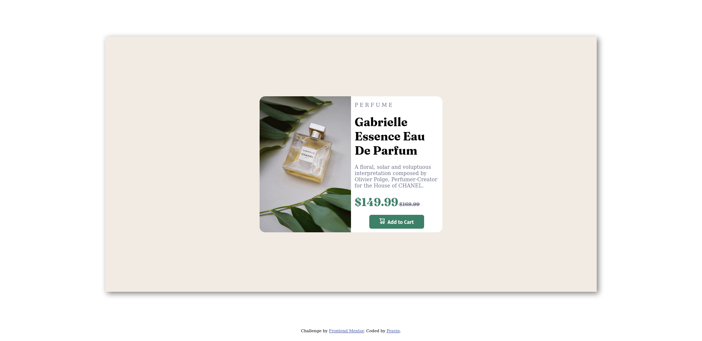

# Frontend Mentor - Product preview card component solution

This is a solution to the [Product preview card component challenge on Frontend Mentor](https://www.frontendmentor.io/challenges/product-preview-card-component-GO7UmttRfa). Frontend Mentor challenges help you improve your coding skills by building realistic projects. 

## Table of contents

  - [Overview](#overview)
  - [The challenge](#the-challenge)
  - [Screenshot](#screenshot)
  - [Links](#links)
  - [Built with](#built-with)
  - [What I learned](#what-i-learned)
  - [Continued development](#continued-development)
  - [Author](#author)
  - [Acknowledgments](#acknowledgments)

## Overview
This is my first time working on a practise project. It is a simple preview card which is responsive.

### The challenge

Users should be able to:

- View the optimal layout depending on their device's screen size
- See hover and focus states for interactive elements

### Screenshot

Desktop view of website

Mobile view of website

### Links

- Solution URL: [Add solution URL here](https://github.com/Pravin-hub-rgb/frontend-practise/tree/master/easy/product-preview-card-component-main)
- Live Site URL: [Add live site URL here](https://pravin-hub-rgb.github.io/frontend-practise/easy/product-preview-card-component-main/index.html)

### Built with

- Semantic HTML5 markup
- CSS custom properties
- Flexbox
- CSS Grid

### What I learned

I learned about light color palletes that look very good as backgroud of a div. Making a website responsive so that it can be viewed in all devices. This is the beginning for me of making websites responsive.

### Continued development

Making websites responsive in a way that navbar can have different function while in desktop mode and different function in mobile screen.
I want to learn more about media queries.

## Author

- Website - [Pravin](https://www.your-site.com)
- Frontend Mentor - [@Pravin-hub-rgb](https://www.frontendmentor.io/profile/Pravin-hub-rgb)

## Acknowledgments

The credit goes to Kunal Kushwaha who encouraged me to learn front-end skills through his road map. Without him I wouldn't know about 'Frontend Mentor' website.

